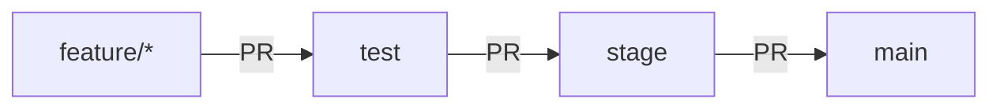

# Git workflow — saucedemo-e2e-tests

This document describes the branching flow, code promotion strategy, and protection rules used in this repository.

## Branch structure

Three permanent environment branches, plus feature branches that each dev creates and discards.

| Branch | Purpose | Ever deleted |
|---|---|---|
| `feature/*` | Work in progress for a specific task | Yes, after merging |
| `test` | First validation environment | No |
| `stage` | Pre-production environment | No |
| `main` | Production / release branch | No |

Code is always promoted in one direction: `feature → test → stage → main`. Never the other way around (except for the hotfix exception described at the end).

## Protection rules (Rulesets)

Each environment branch has its own ruleset under Settings → Rules → Rulesets:

| Ruleset | Target branch | Required status check |
|---|---|---|
| `protect-test` | `test` | `smoke-tests` |
| `protect-stage` | `stage` | `regression-tests` |
| `protect-main` | `main` | `regression-tests` |

Configuration shared across all three:

- **Enforcement status**: Active
- **Bypass list**: empty — no one, not even the owner, can bypass the rules
- **Restrict deletions**: enabled — the branch cannot be deleted
- **Block force pushes**: enabled — no one can rewrite history
- **Require a pull request before merging**: enabled — no direct pushes
- **Require status checks to pass**: enabled, with the matching check from the table above
- **Require branches to be up to date before merging**: enabled — the PR is validated against the current state of *its own* target branch specifically, not against `main` in general

## How a change gets promoted

1. A `feature/task-name` branch is created from `test`.
2. A PR `feature/task-name → test` is opened. `smoke-tests` runs. If it passes and the branch is up to date with `test`, it's merged using **Squash and merge**.
3. Once `test` has accumulated the changes ready to promote, a PR `test → stage` is opened. `regression-tests` runs. Merged with squash.
4. Once validated in `stage`, a PR `stage → main` is opened. `regression-tests` runs again (final gate). Merged with squash.
5. `test` and `stage` are **never deleted** at any step — they stay ready for the next cycle.

## Notes

- The "This branch is up to date with main" banner shown on the repo's home page is purely informational — GitHub always compares any branch against the default branch (`main`), regardless of rulesets. It has no relation to the ruleset's "up to date" rule, which only acts when merging a PR and only checks against that PR's specific target.
- **Exception — emergency hotfix**: if a change is ever merged directly to `main` without going through `test`/`stage` (via an emergency PR), it's good practice to open a follow-up PR from `main` into `stage` and `test` afterward so they don't drift out of sync. This is not the normal flow, just an exception case.
- With **squash merge**, each promotion between environments ends up as a single clean commit on the target branch (e.g. "Promote stage to main — release X"), even if it involved several intermediate work commits. The full detail remains available in the closed PR if needed.
